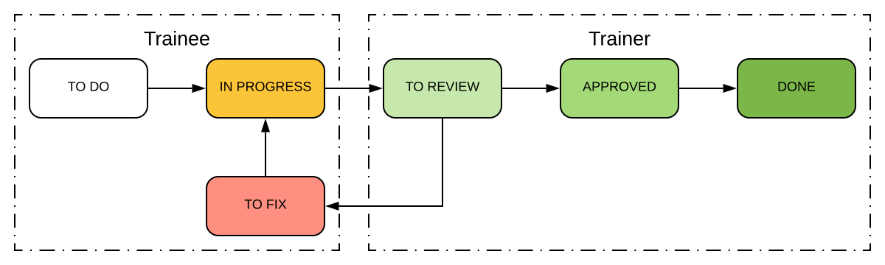

= M-JC1-66-20

The material for the group M-JC1-66-20

== Intro

* Необходимо выполнить действия описанные в блоке *Communication* 
* Необходимо установить программное обеспечение указанное в блоке *Software*

== Feedback

link:https://forms.gle/MhYeTxiHfruSRNcr5[Google Form for a feedback]

== Process

=== Основные концепции

* One lesson ~ One theme ~ One practice task ~ One branch with theme name.
* Branch для theme содержит стартовый проект для текущей темы.
* Выполнение задания по какой-то теме происходит ТОЛЬКО в соответствующей ветке.

=== Процесс работы над заданиями/темами

Схема процесса работы над заданиями/темами:

* *TO DO*
** после окончания занятия по какой-то теме, дается практические задание по этой теме

* *IN PROGRESS*
** прочитать теоритический материал (контроль: test, влият на GRADE)
** выполнить задания предложенные преподавателем (контроль: manual review with your unit-tests, влияет на GRADE)
*** на выполнение задания отводится 6 дней, следующих за днем когда занятие по этой теме состоялось
*** одно задание - один commit
*** сделать push на GitHub после выполнения заданий
** выполнить задания в рабочей тетради (контроль: manual review with trainer, не влияет на GRADE)

* *TO REVIEW*
** Cделать *Pull Request* в соответствующую ветку repository преподавателя.

* *TO FIX*
** Если после *code review* есть замечания по коду, то их необходимо устранить.
** Если не все задания были выполнены, то следует разобраться в правильно выполненом задании.

* *APPROVED*
** Проведен *code review* и все задания выполнены правильно, без значительных недочетов.

* *DONE*
** Все необходимые действия (*code review*, выставление отметок, закрытие *PR* и т.д.) над данным задание выполнены.

== Lessons

|===
|№|Theme|Date|Due date|Homework|Test
|1|Введение.|22.12.2020|24.12.2020|link:https://github.com/rakovets/course-java-basics/tree/intro[branch: intro]|link:https://forms.gle/XHwuj6ZJbbUqP7xA6[intro]
|2|Типы данных. Переменные. Операторы. Методы.|24.12.2020|30.12.2020|link:https://github.com/rakovets/course-java-basics/tree/operators[branch: operators]|link:https://forms.gle/5wDwXhgScm7JVt668[data-types]
|3|Операторы if/switch.|29.12.2020|04.01.2020|link:https://github.com/rakovets/course-java-basics/tree/conditional-statements[branch: conditional-statements]|link:https://forms.gle/96Tid9tRY9m3bhwZ9[conditional-statements]
|4|Циклы.|05.01.2021|11.01.2021|link:https://github.com/rakovets/course-java-basics/tree/loops[branch: loops]|-
|===

== Communication

* *Telegram*:
** Зарегистрироваться.
** Отправить сообщение тренеру, которое содержит Ваше имя и фамилию на английском языке, используя никнейм `@rakovets` или номер `+375297902100`.
*** В случае возникновения проблем с поиском, напишите тренеру на email
** Временно отключаем настройки политики по добавлению в группу, так как тренер не сможет добавить в группу
** После этого, Вы будете добавлены в 2 группы:
*** `M-JC1-66-20-dev` - используется для взаимодействия в группе
*** `M-JC1-66-20-prod` - используется для объявлений и решения вопросов/проблем, которые не могли быть решены в первой, так как преподаватель мог не увидеть/прочитать Ваше сообщение.

* *Gmail*:
** Зарегистрироваться.
** Подписываемся на *YouTube* канал: link:https://www.youtube.com/channel/UCIztUGTxSCyqksE3HxFgI_w[Dmitry Rakovets].
** Отправить сообщение тренеру в Telegram, которое содержит Ваш *email* (*gmail*).
** После этого вы получите доступ к *электронному журналу*, который сожержит текущие отметки.
** На этот *email*, так же будет предоставляться доступ к закрытым видео на *YuoTube*, если таковые будут.

* *GitHub*:
** Зарегистрироваться.
** Подписываемя на пользователя: link:https://www.github.com/rakovets[Dmitry Rakovets].
** Ставим "звездочку" для репозитория `course-java-basics`, `wiki`, `presentation`.
** Делаем `fork` для репозитория `course-java-basics`.
** Почти все задания будут выполняться в репозитории `course-java-basics`.

* *LinkedIn*:
** Зарегистрироваться.
** Отправляем `Connect` пользователю: link:https://www.linkedin.com/in/rakovets/[Dmitry Rakovets].
** Оформляем текущее место работы: IT-academy, Trainee (можно подсмотреть у преподавателя).

== Software

* link:https://jdk.java.net/java-se-ri/11[OpenJDK 11]
* link:https://www.jetbrains.com/idea/download[IntelliJ IDEA Community Edition]
* link:https://git-scm.com/[Git]
